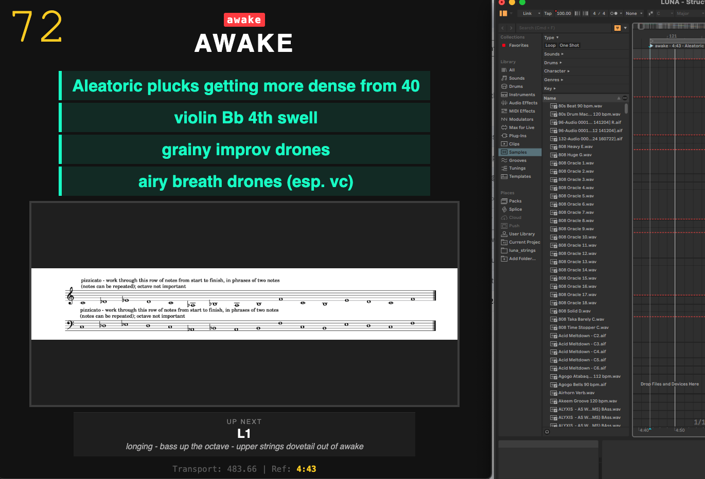

# ABLETON SCORE

The project is a way to connect Ableton Live with notated music (rendered as PNG files) and consists of two main things:
1. a rehearsal page which can be hosted on the internet and protected with a password, to allow musicians to hear an exported audio version of the Ableton session and see the notation for that section
2. A main page which can be used for rehearsal and performance, which syncs to an Ableton session via AbletonJS and uses locators to display the relevant sheet music / text instructions / other graphics, plus a countdown to the next section and other contextual information.   

Please get in touch if you'd like me to put together a version of this tailored to one of your projects (i.e. if you need to sync written notation with Ableton Live sets and playback). I can do this on commission.

Otherwise, the code is provided as is and with no licence, do what you like with it!

## INSTALLING ABLETONJS 
1. please look this up yourself, I will add instructions later.... sorry!

## FILES EXPLAINED
syncLocators.js - searches locators in your project and (assuming they are formatted correctly) updates the timestamps
dumpLocators.js - exports locators to a log file
server.js - runs the server 

## DISCLAIMER
syncLocators.js and importLocators.js both perform destructive edits to your Ableton session. Please backup the session each time before using. 

## INSTALLING THE APPLICATION
1. Clone the repository to your local machine
2. run npm install
3. change the password and username in the server.js file
4. To run the server on your local machine, run: node server.js
5. access the main page at http://localhost:3000/index.html
6. access the Rehearsal Tool at http://localhost:3000/static.html
7. Open your ableton set. Once locators are set, run dumpLocators.js to export them to the locators_log.txt file. Place this file in the "public" folder to set up the Rehearsal tool. See the section "IMPORT LOCATORS ..." for more details
8. server.js reads the locators directly from the currently open Live session for use on the main page (index.html)
9. Place all score images in "public/images". Their names should match locators but be in lower case. I use two letter codes for tracks / large sections and numbers / numbers and letters for smaller sections. e.g. SR1 SR2 SR3 SR1b SR2 - multiple locators can have the same code if they need to refer to the same image
10. When "server.js" is running, and index.html is open, Ableton should automatically sync with it, displaying any images whose names are the first portion (before a space and hyphen) of the most recent locator in Ableton. 

## CREATING LOCATORS IN ABLETON

1. Name Locators with a short code name referring to its score material, followed by space hyphen space (" - ") and then any text instruction
2. separate individual lines of text instruction with more hyphens
3. You can embed timecodes manually, or run syncLocators to add/update timecodes into the names of the markers. The logic for that sync is outlined below.
4. To run syncLocators, navigate in a terminal to the root folder and run "node syncLocators.js" (this will take a fair amount of time as it steps through the entire Ableton set)
5. To export the current names of markers, run "dump-locators.js"
6. It may be easier to name and edit the markers in more detail in the text file rather than from the Ableton session. to do this, run an initial export, edit the locator_log.txt file, and run "node importLocators.js" to update them.
7. N.B. The dump-locators.js script will not update the written in timecodes in the locators, if they have changed, so it is good to run syncLocators again. 

## IMPORT LOCATORS INTO THE WEB PAGES AND USE TO TRIGGER SCORED
1. Copy the latest version of locators_log.txt into the public folder
2. Ensure it is not named something else, and ensure it follows the format created by dump-locators.js
3. Any locators in this file should now trigger any PNG files with the same name as the first portion of the marker
4. Import an MP3 of your set into the audio folder. Rename the relevant file in static.html
5. Download audiowaveform and run this on your audio file: audiowaveform -i input_file.mp3 -o peaks.json --pixels-per-second 20 --bits 8
6. Put the resulting file "peaks.json" in the audio folder

## IMPORTING AND EXPORTING LOCATORS TO ANOTHER PROJECT
1. importLocators.js is dodgy, it doesn't work consistently after trying many things.
2. What does work is to use a modified version of a Max4Live object made by RiversL
    https://www.maxforlive.com/library/device/8295/exportlocatorids
3. I modified this object to have an import function too. A copy of my modified object is in this repository.
4. Export your locators first using the max4Live object.
5. Go to new project and drop in the Max4Live object.
6. Make sure the project is as long as the source project (even with a blank MIDI clip)
7. Run import.
8. If the tempo map of your current project and the old project are different, there may be inaccuracies
9. This is very very very much alpha version software, the way to do this stuff in Ableton is really complicated and my solution works just about well enough for my own needs, it will probably fall short in many contexts. But better than nothing!
 
# syncLocators Logic
Original Name	Logic Applied	Resulting Name
Intro	Zero hyphens	Intro - 0:00
Verse-	One hyphen, no text after	Verse - 0:45
Chorus-Heavy	One hyphen + text	Chorus - 1:12 - Heavy
Solo-OLD-Fast	Two+ hyphens	Solo - 2:05 - Fast

